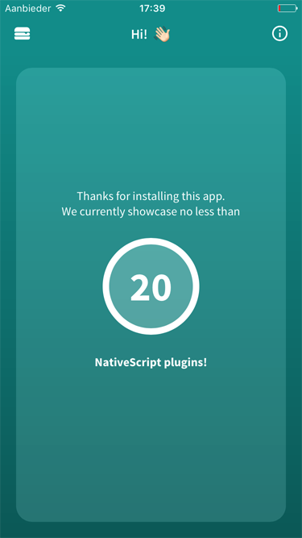
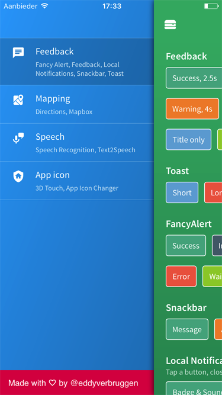
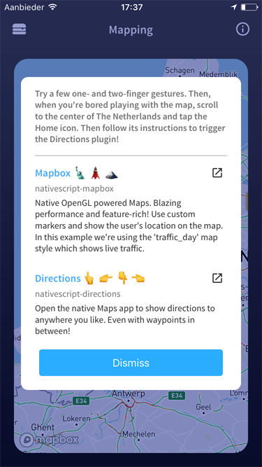

NativeScript plugin showcase
----------------------------

[![Appstore download][appstore-image]][appstore-url]
[![Playtore download][playstore-image]][playstore-url]


[![Twitter Follow][twitter-image]][twitter-url]


[appstore-image]:screenshots/apple-appstore-badge.svg
[appstore-url]:https://itunes.apple.com/WebObjects/MZStore.woa/wa/viewSoftware?id=1281334006
[playstore-image]:screenshots/google-playstore-badge.svg
[playstore-url]:https://play.google.com/store/apps/details?id=org.nativescript.pluginshowcase
[build-status]:https://travis-ci.org/EddyVerbruggen/nativescript-pluginshowcase.svg?branch=master
[build-url]:https://travis-ci.org/EddyVerbruggen/nativescript-pluginshowcase
[build-status]:https://travis-ci.org/EddyVerbruggen/nativescript-pluginshowcase.svg?branch=master
[build-url]:https://travis-ci.org/EddyVerbruggen/nativescript-pluginshowcase
[twitter-image]:https://img.shields.io/twitter/follow/eddyverbruggen.svg?style=social&label=Follow%20me
[twitter-url]:https://twitter.com/eddyverbruggen

   

> [Watch me demo this app during my plugins talk at {N} dev day EU (YouTube) 🗣](https://www.youtube.com/watch?v=WqhHorPcnyo)

### What's this?
Glad you asked 😄.. I need it to demo a few plugins and wanted to play a bit more with NativeScript & Angular.
This was also a great opportunity for me to properly play with Webpack, AoT, Uglify, and (even) Appium.

### Plugin themes included
- [Feedback](app/feedback/)
- [Mapping](app/mapping/)
- [Speech](app/speech/)
- [Input](app/input/)
- [App Icon](app/appicon/)
- [Firebase](app/firebase/)
- [Augmented Reality](app/ar/)


### CanIUse?
Sure, you can either download it from the [AppStore](https://itunes.apple.com/WebObjects/MZStore.woa/wa/viewSoftware?id=1281334006) or [Play store](https://play.google.com/store/apps/details?id=org.nativescript.pluginshowcase), or build it yourself.

```bash
git clone https://github.com/EddyVerbruggen/nativescript-pluginshowcase
cd nativescript-pluginshowcase
npm run ios
# or: npm run android
# or: npm run ios.emulator
# or even: npm run start-ios-bundle (for a much faster startup experience because of Webpack with Uglify)
```
